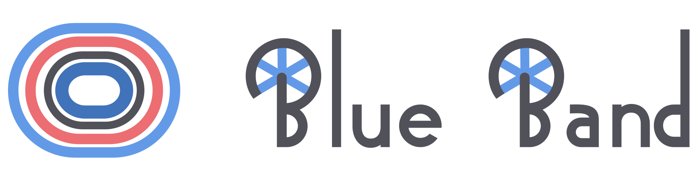

<p align="center">
  
</p>


<p align="center">
  <a href="https://github.com/nicoborghi/BlueBand/"></a>
  <a href="https://github.com/nicoborghi/BlueBand/blob/main/LICENSE"></a>
  <a href="https://codecov.io/gh/nicoborghi/BlueBand"></a>
  <a href="https://claude.ai"></a>
</p>

Commissaire console for track cycling competitions: licence check, race management,
classifications, decisions, communiqués. Based on streamlit.

> [!NOTE]
> **Experimental** - used at the Italian Youth Track Championships (2025, 2026)
> and nowhere else. Most of the codebase relies heavily on AI-generated code.

```bash
streamlit run app.py
```

Guide: [`docs/GUIDA.md`](docs/GUIDA.md) (italiano) ·
[`docs/GUIDE.md`](docs/GUIDE.md) (English)

## Pages

| Page | What it does |
|---|---|
| **Gare** (races) | Runs a race: composition, result entry, classification, printing. Every save is durable. |
| **Verifica** (check-in) | Licence check and entry-list editing: counters, tabella specialità, quota checks, edits recorded as patches. |
| **Decisioni** (decisions) | The jury's register: one row per decision - category, event, round, bib, UCI code (`A1`, `C3`) - with the sentence that goes out under it. |
| **Documenti** (documents) | Everything printed that is not a race sheet: entry lists, batches (by category, event, day, comunicato, per team), the comunicato register. |
| **Statistiche** (statistics) | The medagliere, with the podiums it is counted from and the specialità not concluded yet. |
| **Programma** (programme) | Defines the competition: days, events per category, rounds, comunicato register. Writes `programme.yaml`. |
| **Impostazioni** (settings) | Entry file and its reload, what a team is, output folder, sheet appearance, backup. |

A decision is normally *written* where it was taken - the Decisioni panel in the
Gare sidebar - prints on the results of that round as a tinted box and, if it is
a warning (degree A), follows the rider as a `W` on the dorsale through the
event; two in one round are a disqualification.

Vocabulary: `competition` is the meeting, `event` the title contested, `round`
the phase.

## Where things live

```
core/       the domain, without streamlit: all of it testable headless
  i18n/       THE TRANSLATION DOCUMENT: one catalogue per language
                (it.py, en.py) behind one set of lookups
  config.py   programme.yaml -> dataclass;  programme.py: and back again
  rounds.py   what a format runs: the fasi proposed from the regulation
  distances.py  regulations/distances.json - how long, and how often it sprints
  catalogue.py  regulations/events.json - the specialità, ready to add
  models.py   Rider, Team, Pair, RaceState, Status
  store.py    atomic JSON, snapshots, journal, backup
  entries.py  Excel import (both shapes), overlay of jury edits, validation
  checks.py   what is checked in what the jury types
  parse.py    the jury's shorthand: sprints, heats, times
  race.py     service layer: who is entered, which format applies, ranking
  formats/    base, group, timed, sprint, keirin, omnium
  decisions.py / communiques.py / recap.py / medals.py
render/     Document/Table/Column -> HTML -> PDF (headless Chromium)
ui/         streamlit
  notify.py   HOW THE APP SAYS SOMETHING: error / warn / info / ok / flag
  savebar.py  WHERE A PAGE IS SAVED: the pinned strip at the foot of the sidebar
  state.py    the only place that knows about st.session_state
  style.py    print.css on the app's own page, and the sidebar nav
  icons.py    the nav icons, as SVG paths: nothing is fetched from a CDN
  pages/      races, check_in, decisions, documents, stats, programme,
              settings, setup (+ startlists.py, printing.py behind Documenti)
```

### Two shared layers

**`core/i18n/` is the only place with translations in it** - column headings,
button names, help texts, warnings, errors - in dictionaries keyed in English
(`FIELDS`, `RACE`, `DOCS`, `UI`, `HELP`, `MSG`). One module per language
(`it.py`, `en.py`), the same keys in each; fixing a wording the jury dislikes
is editing one line in one dictionary, and adding a language is adding one
module and listing it in `CATALOGUES`.

```python
label("bib")                    # "Dors."     a column
ui("save_pdf")                  # "Salva PDF" a control
msg("bib_not_entered", bib=17)  # a message
help_text("status_dns")         # a field's tooltip
```

`ui`, `msg` and `help_text` raise on an unknown key: a missing label is a bug,
not a word to invent. `label` falls back to the key, so a new column still comes
out readable, and a key one language does not have yet is answered from Italian
rather than failing. `tests/test_i18n.py` checks that every key asked for
exists, that every language answers all of them with the same placeholders, and
that no module writes Italian of its own.

The language is a per-competition setting (**Impostazioni → Lingua**, stored in
`settings.json`) and is set once per rerun, before anything draws a word. It
moves the catalogue only: what `programme.yaml` spells out - the names of the
categories, the events and the rounds - prints as it is written there.

### Building a programme

A competition folder with no `programme.yaml` opens on **ui/pages/setup.py**:
the manifestazione, the pista and the categorie, then the app runs normally.
From there the Programma page builds it day by day - a race is added with the
questions its format actually asks (a velocità qualifies 12 or 8 and does or
does not ride its 5°-8°, a madison eliminates so many coppie per batteria) and
comes out with all its fasi, each carrying a distance from
`regulations/distances.json`, the giri derived from the track length and the
volate from the sprint interval. Every value is editable, and ↩ puts the
regulation back without touching the notes or the start times.

The comunicato numbers follow the running order while they are unfrozen: move a
race up the day and its comunicati move with it (`communiques.autonumber`). A
number typed by hand is pinned, one already issued never moves at all, and the
freeze switch stops the whole thing once the register is settled. Programma →
*Foglio programma* prints the running order with those numbers beside it.

A specialità is added from `regulations/events.json`, which knows its code, UCI
abbreviation, format and riders per squadra - the chilometro and the 500 ride on
the machinery of the inseguimento, two at a time or one at a time as the jury
prefers. The names in that file are per language, because they are written into
`programme.yaml` and printed as they stand there.

**`ui/savebar.py` is the only place a page is saved from.** Salva - and the way
back from it, *Ripristina versione precedente* or *Ricarica dal file* - is
pinned to the foot of the sidebar on every page that has something to save, so
it never scrolls away under a long sheet. The strip is drawn before the page
body, so it *records* the press and the page acts on it at the end, once every
field of that run has been read.

The Gare page opens with a row of pills: the fasi last saved, `CAT · Specialità
· Fase`, one tap back to any of them - because a championship is not run one
specialità at a time.

**`ui/notify.py` is the only way the app says anything.** Red means "fix this",
yellow "look at this", blue says what to do next, a toast is a save. The short
marks under a field (`notify.flag`, notation in `core/checks.py`):

| Mark | Meaning |
|---|---|
| `?7` | bib 7 is not among the starters of this race / heat |
| `!3` | bib 3 appears twice |
| `-2` | 2 bibs missing from the line |
| `<4` | fewer than four placed (a sprint scores four) |
| `?` | the line cannot be read |

None of them blocks the work: they are there to be looked at while there is
still time.

## Data layout

One folder per championship under `competitions/` (override with
`COMMISSAIRE_TRACK_DATA`):

```
competitions/CITA26/
  programme.yaml        # track, categories, events, rounds, distances, register
  entries_import.json   # snapshot of the entry workbook (read-only)
  entries_overlay.json  # jury edits, each with a reason and a date
  races/<id>.json       # the state of every race
  comunicati.json       # the comunicati actually issued
  decisions.json        # the jury's decision log
  settings.json         # local choices (output folder, what a team is)
  out/<NNN>_<slug>.pdf  # produced comunicati (folder configurable)
  .snapshots/           # the previous content of every file written
  journal.jsonl         # append-only log of every write
```

**The Excel entry list is never modified.** The import copies it; every edit is
a patch keyed by UCI ID, re-applied on top of each new import, so reloading a
fresh export keeps bibs, teams, event entries and check-in ticks. Both shapes
are told apart automatically: the flat ksport export (no event columns - the
programme says which events a category rides) and the master workbook with a
sheet per category.

## The programme

`programme.yaml` describes everything that changes from one competition to the
next: track length, categories, which events each contests, the rounds of every
race with distance / laps / sprints, the days, entry quotas and the comunicato
register. Running next year's edition means editing one file.

It is edited from the **Programma** page and written by an emitter of our own
with a stable layout (`core/programme.py`): saving the same programme twice
gives the same bytes, and read-write-read returns the same competition - the
guarantee everything else rests on. Notes go in the `note:` fields, which
survive a save; a comment in the file does not. An explicit distance or lap
count wins over the one derived from the track length: some races do not follow
the formula.

### One comunicato can carry several documents

A comunicato is a *number on paper*, and more than one document can go out under
it - as the sprint and the keirin have always done. The register declares it
with `with:`, the second document inheriting what it does not say:

```yaml
- {n: 7,  day: 1, cat: AL, event: ins_squadre, round: "Qualificazioni", doc: partenti}
- {n: 95, day: 3, cat: AL, event: velocita, round: "Turno 1", doc: risultati,
   with: [partenti_recuperi]}
# an explicit `round` is a choice: a classification belongs to the event, not
# to any round of it
- {n: 25, day: 1, cat: AL, event: vel_squadre, round: "Finali", doc: risultati,
   with: [{round: "", doc: classifica}]}
```

On the Programma page they are adjacent rows with the same number; in Documenti
→ *Serie di documenti* → *Per comunicato* they are built into one PDF.

## Formats

| Format | Events | What the jury types |
|---|---|---|
| `points` / `tempo` / `scratch` | points race, tempo race, scratch, omnium prove | sprint order: `3,7,1,9-7,3,9,1` |
| `elimination` | elimination | bibs in the order they went out |
| `timed` / `timed_team` | individual and team pursuit, team sprint | heats `1,2,3,4-5,6,7,8/…` and the times |
| `madison` | madison | like a points race, scored by coppia |
| `bracket` (sprint) | sprint | scheme picked on the 200 m, then who won each run |
| `bracket` (keirin) | keirin | heats composed by the jury, then each finish |
| `omnium` | omnium | the four prove summed (40-38-36…) |

Statuses: `DNS`, `DNF`, `ABD`, `DSQ`, `NP` are not placed; `REL` stays in the
classification, at the back, printed `8° REL`. In a bunch race `DNF` and `ABD`
are ranked in reverse order of entry - the last to leave heads them - a `DNF`
keeps the points it scored and an `ABD` does not, and a `DNS` is dropped from
the table and named in a line under it.

A **pursuit** qualifies four squadre and *Carica Finali* seeds the 3/4 and the
1/2. A final that is not ridden is closed from the sidebar, either *a pari
merito* - the two share the lower place, both 2° or both 4°, and no champion is
named - or on the qualifying times.

A **madison** and an **omnium** ridden in qualifying heats are composed by the
jury, not by a result: the programme declares a round `kind: setup` (with
`eliminate: N`) which holds the composition and, for a madison, the coppia
numbers. *Carica in finale* / *Carica nelle prove* then deals the qualifiers
across what follows.

The **keirin** is seeded from no race at all: the number of entries picks a row
of UCI table 3.2.135 (`core/formats/keirin.py`), which decides the heats, who
goes through, whether repechages and quarters are ridden and how many make the
two finals. Heats and rounds elsewhere use the serpentine distribution of the
UCI tables (Part 3).

## Printing

**Salva PDF** writes the file into the output folder with the comunicato number
in its name (`018_classifica-es_madison_finale.pdf`) and opens it. The PDF comes
from a headless Chromium - what Ctrl+P would give, without the browser's band of
date and URL. The destination is chosen in Impostazioni and can be anywhere: a
Drive folder shared with the jury, a USB stick.

Where Chromium works is not where the document ends up: page and PDF are written
to the first directory it can actually use (`render/pdf.work_dirs`), and only
the finished bytes are saved to the destination - a snap Chromium can read
neither `/tmp` nor a `/mnt/...` Drive mount, which is where the comunicati
usually live. With no Chromium at all the self-contained HTML is saved instead
and the reason goes into `journal.jsonl`.

The sheets carry a full-width letterhead and footer repeated on every page
(`thead` / `tfoot` of one table), one line per rider with over-long values
truncated rather than wrapped, teams and heats separated by a rule, and the
signature at the foot. Landscape is opt-in: on a named page Chrome does not
repeat the letterhead.

## Tests

```bash
python -m pytest tests -q
```

The entry-list tests run against the competition's real workbook and are skipped
when it cannot be reached.
